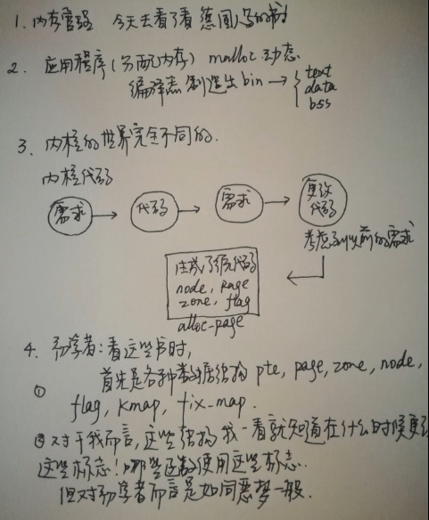
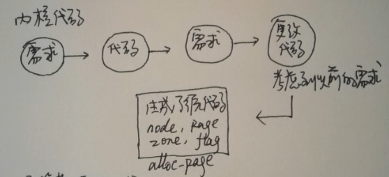
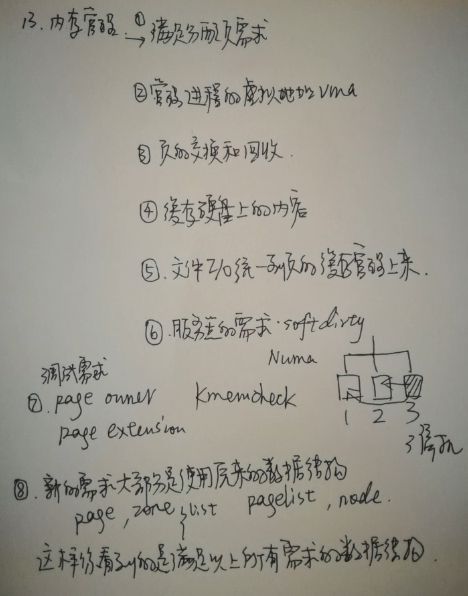
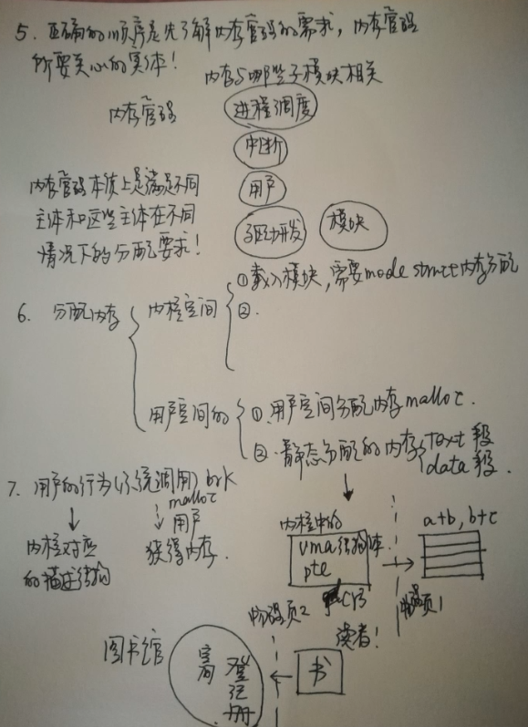
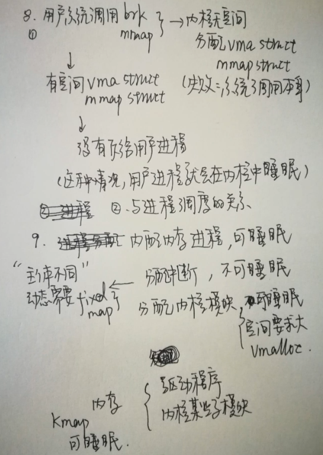
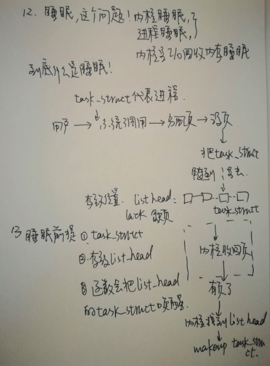

<!-- TOC depthFrom:1 depthTo:6 withLinks:1 updateOnSave:1 orderedList:0 -->

	- [相关站点](#相关站点)
	- [参考书目](#参考书目)
	- [内存管理为什么那么难-1](#内存管理为什么那么难-1)
	- [内存管理为什么那么难-2](#内存管理为什么那么难-2)
	- [内存管理为什么那么难-3](#内存管理为什么那么难-3)
	- [END](#end)

<!-- /TOC -->

## 相关站点

B站点:<https://www.bilibili.com/video/av25579625>

感谢作者无私奉献~

## 参考书目

《深入Linux内核架构》

德国大佬写的书，译者郭旭极度低调，全书找不到他半点介绍~~这，估计纯粹为了翻译吧，大佬就是大佬。

## 内存管理为什么那么难-1

* 为什么struct page、struct zone、struct node如此复杂？
* 对初学者如同噩梦~

* **要理解内核不应该从数据结构开始，你先要理解需求**，那些数据结构可以看熟悉些。
* 内核为了提高新能把内存管理跟很多子模块绑定在一起

* 内存管理随OS发展不断扩大功能
* 能把硬盘当内存用，其实在一开始个cool技术。不断增加特性，越发复杂。
* 但是不管内存管理如何复杂，新特性基本只是增加处理函数，虽然数据结构不可少，但是条件是尽可能不增加数据结构。或者在原有数据结构上增加数据项，因此常用的数据结构会变得非常大。

* 德国大佬写书的时候，他对整个系统其它很多模块都有所了解。所以他解释可能很简单，甚至忽略掉初学者不为所知的“潜规则”

* 不同需求造成不同函数，因此重点不在于函数在于需求，可是，内核源码不会告诉你函数干啥的，先不说函数名搞得多蛋疼（字符太少，不够表述，历史遗留）。就算有详细函数注释，但是函数间调用关系，被切分成很多很小的子函数，也足够让你喝一壶的了

* 读者去找图书馆借书，图书馆必须有登记册记录读者借书情况，但是如果登记册都写满了，肯定不能把书借给你。或者登记册可以写，但是没有书。借给你书，归还也要管理。

* 固定映射，不能睡眠。
* 读者到图书馆借某本特定的书，管理员可能不是直接去取书，而是各种浪之后再去。读者等个半死，读者不耐烦上个厕所，结果有人来借同样的书，这时候管理员倘若取到书，他会给谁？？

* 其实感觉睡眠换入换出好浪费时间，好麻烦呀，但是综合考虑，CPU速度超级快，内存超级小，酱紫就可以跑了。还记得以前玩单片机的时候搞一个闹钟，怎么让屏幕闪烁，就是一个while循环，只是我觉得可能拖不动，会太慢。其实可以的。。。PS当时弱智不懂用中断，你懂得，但是CPU是可以用中断的。
* 区分哪一些睡眠代表进程？哪一些代表内核？不同的行为主体

## 内存管理为什么那么难-2

## 内存管理为什么那么难-3

## END
