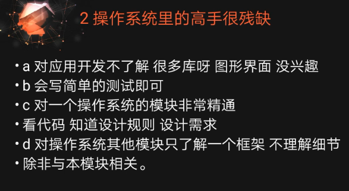
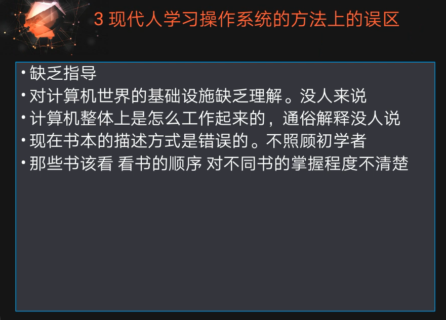
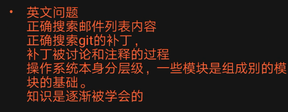
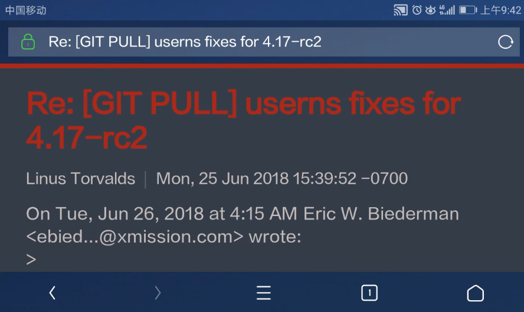
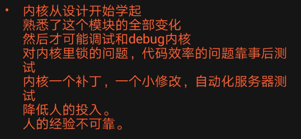
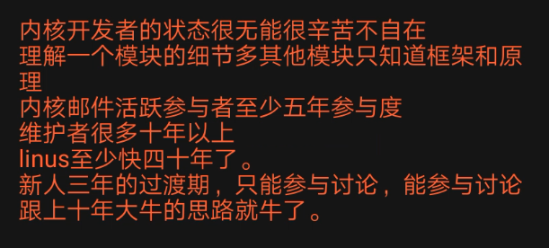

<!-- TOC depthFrom:1 depthTo:6 withLinks:1 updateOnSave:1 orderedList:0 -->

	- [相关站点](#相关站点)
- [操作系统为什么那么难](#操作系统为什么那么难)
	- [END](#end)

<!-- /TOC -->

## 相关站点

B站<https://www.bilibili.com/video/av25672969>

# 操作系统为什么那么难

* 其实OS商业化少，毕竟都垄断了，顶多驱动。所以找工作还是比较蛋疼的，因为要么要求很严格，高工资，要么要求低，搬砖。
* 典型的嵌入式操作系统对OS了解多一些。

* 大佬们对OS如果研究很透彻，基本埋在土里了？这个。。讲说的比较尴尬~
* OS高手只对某一个模块更熟悉。对其他模块知道原理，了解。设计需求？框架？结构？效率？性能?人的精力非常有限，做不到面面俱到。

* 直接给我一堆代码，特么的不懵逼才怪。Linux源码看起来有点结构，目录树说好的啥啥子功能。但是如果真的去看了就是一团乱麻。高手出来怼了，明明清晰明了。熟悉windows编程的肯定受不了Linux源码各种函数、变量命名方式。
* 很多书籍其实不会照顾初学者感受，不管你，特么的老子就是端出来一团乱码，让你懵逼
* 约定俗成的东西不会讲，字数太多不让发行四不四~
* 有点基础 = 踩过很多坑~
* 很多关于OS都是国外的喲~学OS英语不好那还是得补补才行~

* 专业名词没有解释清楚
* 先把源代码给你，然后一句一句分析。为嘛不一开始讲清楚要干啥？带着这个“干啥”的目标去读源代码才是最合适的。
* **懂的人只给懂的人讲，不懂得人除了不懂还是不懂**
* 英语水平高一点，后期瓶颈，多读国外书籍

* 可以查看补丁相关讨论得知相关概念/修改的缘由
* 知识是逐渐学会
* 国内肯定有很多企业内部有相关内核讨论，但是这些大佬没有公开一些资料，所以，初学者进步其实还是类似于重复造轮子的步骤。
* 资料 + 推理 + 源代码

* 演化
* 耐心看某个邮件列表的讨论

## END
